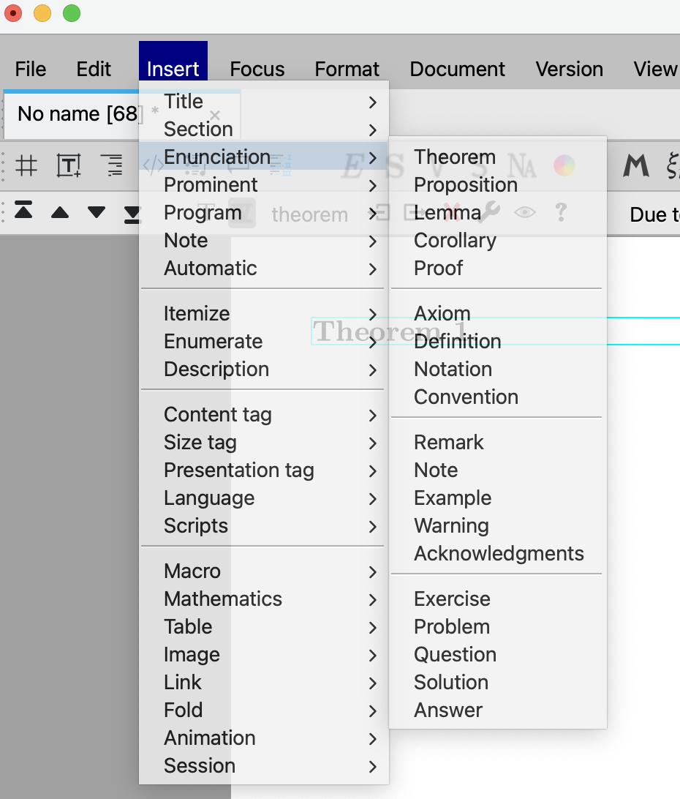

# Comparison between $\LaTeX$ and Liii Stem Suite


The most remarkable functionality provided by Liii Stem Suite is its ability to help users type $\TeX$-like equations in a WYSIWYG interface, significantly faster than $\LaTeX$. 
This speed improvement is achieved not only through the WYSIWYG interface but also through features such as intuitive shortcuts, magic paste, and equation transformation. In this short article, we introduce these features by concrete examples.

## Built-in environment
In $\LaTeX$, to create a Theorem environment, we must define it in the preamble:

```LaTeX
\documentclass{article}
\newtheorem{theorem}{Theorem}
\begin{document}

    \begin{theorem}
    Theorem here!
    \end{theorem}

\end{document}
```

However, in Liii Stem Suite, most of $\LaTeX$ environments are built-in. The users can simply insert the environment based on the GUI we provided.




At the same time, for environments that are difficult to edit in $\LaTeX$, the Three-Carp AI Engineering Suite provides an extremely user-friendly GUI, such as for aligning multi-line equations. In $\LaTeX$, input...
```LaTeX
\begin{align}
  f (x) \leq & \| g (x) - h (x) \| \\
  \leq & \| g (x) - z (x) \| + \| z (x) - h (x) \| \\
\end{align}
```
compared to inputting within the Three-Carp AI Engineering Suite.


## Intuitive shortcuts and symbol switch

The most labor-intensive aspect of editing $\LaTeX$ documents is remembering and typing mathematical symbols. For example, typing $(\alpha \neq \gamma) \rightarrow (\beta \geqslant \theta)$ in $\LaTeX$ is:

```LaTeX
$(\alpha \neq \gamma) \rightarrow (\beta \geqslant \theta)$
```

In Liii Stem Suite, the above equations can be typed intuitively. For example, $\rightarrow$ can be entered by typing `-` precedes `>`, and $\geq$ can be typed by using `>` precedes `=`. Liii Stem Suite automatically "glues" these commands to create the desired symbols in an intuitive manner. We list more examples:

+  $\implies$: Type `=` precedes `>`.
+  $\leqslant$: Type `<` precedes `=`.
+  $\Leftrightarrow$: Type `<` precedes `=` and then `>`.
+  $\infty$: Type `@` precedes `@`.
+  $\mathbb{R}$: Type `R` precedes `R`.
  
Liii Stem Suite also supports a feature called *symbol switch*. In Liii Stem Suite's math mode, every symbol the user types represents not just a single symbol but a set of related symbols. The user can press the `Tab` key to switch between these symbols. For example, $\alpha$ can be typed by entering `A` and press `Tab`. We list several examples:

+ $\geq$: Type `>` precedes `=` and then press `Tab`.
+ $\leq$: Type `<` precedes `=` and then press `Tab`.
+ $\beta$: Type `B` and press `Tab`
+ $\theta$: Type `J` and press `Tab`
+ $\Theta$: Type capital `J` and press `Tab`
+ $\phi$: Type `F` and press `Tab`
+ $\Phi$: Type capital `F` and press `Tab`

As shown in the following figure, Liii Stem Suite provides hints for most mathematical shortcuts, helping users who may forget certain shortcuts.


## Magic paste

Liii Stem Suite includes a feature called *Magic Paste*. Users can paste content directly from LLMs or from $\LaTeX$ source code into Liii Stem Suite. For example, Liii Stem Suite supports copying and pasting content from LLMs while preserving the formatting of equations and tables. The following example demonstrates Magic Paste from GPT-4:


## $\LaTeX$ source code export

If the user still needs to ultimately edit using $\LaTeX$, we provide a feature to export the $\LaTeX$ source code!


